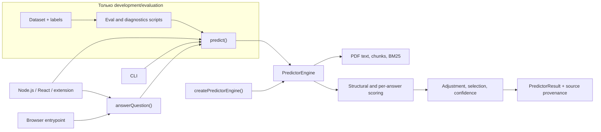

# Архитектура проекта

## Назначение документа

Этот документ описывает текущую runtime-архитектуру `med-pdf-nmo` после
перехода на управляющие классы. Он отвечает на четыре практических вопроса:

- где находится ответственность каждого слоя;
- в каком порядке выполняются стадии predictor;
- куда добавлять новый scorer, resolver или post-processing правило;
- как доказать, что архитектурный рефактор не изменил результаты.

Медицинские сигналы и правила скоринга подробно перечислены в
[`algorithm.md`](./algorithm.md). Причины выбора модульного scorer-подхода и
управляющих классов зафиксированы в
[`ADR 001`](./adr-001-predictor-architecture.md) и
[`ADR 002`](./adr-002-controller-architecture.md).

## Архитектурные ограничения

Runtime обязан сохранять следующие свойства:

- только JavaScript/TypeScript и Node.js/browser runtime;
- полностью локальный и детерминированный inference без LLM и внешних
  интеллектуальных сервисов;
- predictor получает только PDF, вопрос, варианты ответа и runtime-настройки;
- answer key, eval split и тестовые labels доступны только development-скриптам;
- выбор ответа основан на evidence из PDF;
- порядок scorer-ов, корректировок и selection является частью поведения;
- рефактор без изменения логики должен давать строгий zero-delta;
- изменение логики обязательно проходит измеримый dev/holdout eval.

## Контекст системы



`answerQuestion()` — основной пользовательский API. Он преобразует удобный
набор строковых вариантов в низкоуровневый `PredictorInput`, вызывает
`predict()` и сопоставляет выбранные ID обратно с текстами вариантов.

`predict()` — стабильный низкоуровневый API. Он делегирует работу одному
default-экземпляру `PredictorEngine`.

`createPredictorEngine()` создает независимый engine с собственным PDF-кешем.
Это полезно для изоляции нескольких приложений, тестов или явно ограниченного
жизненного цикла кеша.

## Карта каталогов

```text
src/
├── index.ts                         высокий публичный API
├── browser.ts                       browser entrypoint и регистрация PDF.js
├── cli.ts                           Node.js CLI
├── predictor.ts                     composition root и функциональный API
├── pdf.ts                           извлечение и очистка текста PDF
├── chunk.ts                         построение поисковых chunks
├── bm25.ts                          локальный BM25-индекс
├── normalize.ts                     нормализация и токенизация
└── predictor/
    ├── engine.ts                    главный управляющий класс
    ├── runtime.ts                   PDF runtime и кеш
    ├── context-builder.ts           общий контекст одного вопроса
    ├── contracts.ts                 внутренние межслойные контракты
    ├── config.ts                    пороги и feature flags
    ├── scorer-registry.ts           evidence-контракты и группы сигналов
    ├── pipelines/
    │   ├── structural-resolver-pipeline.ts
    │   ├── answer-scoring-pipeline.ts
    │   ├── score-adjustment-pipeline.ts
    │   └── score-adjustment-processors.ts
    ├── scorers/
    │   ├── answer-score.ts          композиция per-answer scorer-ов
    │   ├── classification.ts        тип и структура вопроса
    │   ├── clinical-feature.ts      клинические признаки
    │   ├── definition.ts            термины и определения
    │   ├── list-evidence.ts         списки и их локальный контекст
    │   ├── multi-support.ts         поддержка multi-наборов
    │   └── ...                      остальные узкие scorer-модули
    ├── selection.ts                 калибровка и single/multi selection
    ├── confidence-calculator.ts     confidence без изменения selection
    ├── result-builder.ts            сборка публичного результата
    └── source-context.ts            display-only provenance после selection

scripts/                              eval, diagnostics и offline-эксперименты
__test__/                             unit, architecture и leakage tests
docs/                                 решения, алгоритм и история измерений
```

## Runtime pipeline

```mermaid
flowchart LR
  input["PredictorInput"] --> validate["Validate and normalize"]
  validate --> runtime["PdfRuntimeStore"]
  runtime --> context["PredictionContextBuilder"]
  context --> structural["StructuralResolverPipeline"]
  structural --> score["AnswerScoringPipeline"]
  score --> adjust["ScoreAdjustmentPipeline"]
  adjust --> select["AnswerSelector"]
  select --> confidence["ConfidenceCalculator"]
  confidence --> build["PredictionResultBuilder"]
  build --> output["PredictorResult"]
```



`PredictorEngine.predict()` является единственным владельцем этого порядка:

1. Объединяет `DEFAULT_CONFIG` с options, проверяет PDF-вход, режим и варианты.
2. Нормализует варианты в стабильные объекты `{ id, text }`.
3. Получает `PdfRuntime` из `PdfRuntimeStore`.
4. Один раз строит общий `PredictionContext`.
5. Запускает document-level structural resolver-ы.
6. Считает initial raw score каждого варианта в исходном порядке.
7. Применяет set-level и post-scoring корректировки.
8. Калибрует score и выбирает single/multi набор.
9. Рассчитывает confidence, не меняя выбранные ID.
10. После selection собирает evidence, diagnostics и UI provenance.

Перестановка этих стадий считается изменением логики, даже если сигнатуры
методов остались прежними.

## Управляющие классы

| Компонент | Ответственность | Состояние |
| --- | --- | --- |
| `PredictorEngine` | Валидация входа и строгий порядок всего lifecycle | Только ссылки на зависимости |
| `PdfRuntimeStore` | Извлечение PDF, chunks, BM25 и переиспользование runtime | `Map` и `WeakMap` кеши |
| `PredictionContextBuilder` | Общие токены, intent, top pages, строки, списки и модели таблиц | Нет request-state |
| `StructuralResolverPipeline` | Document-level решения, работающие сразу с набором вариантов | Нет |
| `AnswerScoringPipeline` | Один и тот же per-answer scoring contract и исходный порядок ответов | Injected `scoreAnswer` |
| `ScoreAdjustmentPipeline` | Последовательный запуск set-level и post-scoring правил | Injected ordered processors |
| `AnswerSelector` | Калибровка raw score и single/multi selection | Нет |
| `ConfidenceCalculator` | Оценка уверенности уже выбранного ответа или набора | Нет |
| `PredictionResultBuilder` | Стабильный `PredictorResult`, diagnostics и provenance | `SourceContextBuilder` |
| `SourceContextBuilder` | Расширение короткого evidence до display-ready фрагментов | Нет |

Классы используются только для lifecycle, состояния, фиксированного порядка и
dependency injection. Нормализация, поиск, scorer-эвристики и числовые
преобразования остаются функциями.

## Основные контракты данных

| Контракт | Содержимое | Владелец создания |
| --- | --- | --- |
| `PredictorInput` | PDF, вопрос, варианты, mode и cache key | Публичный API |
| `PdfRuntime` | Извлеченный `pdfText`, `chunks` и BM25 `index` | `PdfRuntimeStore` |
| `PredictionContext` | Runtime плюс вычисленные один раз question/document признаки | `PredictionContextBuilder` |
| `StructuralResolution` | `Map<answerId, { adjustment, evidence }>` | `StructuralResolverPipeline` |
| `AnswerScore[]` | Вариант, raw score и evidence | Scoring/adjustment pipelines |
| calibrated scores + selected IDs | Относительные score и итоговый набор | `AnswerSelector` |
| `PredictorResult` | Selection, scores, confidence, evidence, sources и meta | `PredictionResultBuilder` |

`PredictionContext` передается вниз по pipeline и не должен скрыто
перестраиваться внутри каждого scorer-а. Тяжелые document-level структуры
вычисляются один раз на вопрос.

## Composition root и dependency injection

`src/predictor.ts` только связывает реализации:

- создает `PdfRuntimeStore`;
- передает scorer-функции через типизированные зависимости;
- создает три pipeline-класса;
- явно собирает упорядоченный список post-scoring processor-ов;
- создает selector, confidence calculator и result builder;
- собирает из них `PredictorEngine`.

В этом файле не должно появляться медицинских regex, scorer-правил или
selection-порогов.

Обычный вызов использует module-level engine:

```ts
const defaultPredictorEngine = createPredictorEngine();

export async function predict(input, options) {
  return defaultPredictorEngine.predict(input, options);
}
```

Изолированный lifecycle выглядит так:

```ts
import { createPredictorEngine } from "med-pdf-nmo";

const engine = createPredictorEngine();
const result = await engine.predict(input);

engine.clearCache();
```

Для architecture tests можно напрямую создать `PredictorEngine` с тестовыми
реализациями зависимостей и проверить порядок вызовов без настоящего PDF.
Runtime-код не использует глобальный DI-контейнер и не выполняет динамический
поиск классов.

## Кеш и жизненный цикл

`PdfRuntimeStore` сохраняет `Promise<PdfRuntime>`, а не только готовый объект.
Поэтому параллельные запросы одного PDF не запускают повторное извлечение.

- При наличии `cacheKey` используется keyed `Map`.
- Для строкового PDF-входа сама строка может стать ключом.
- Для объекта без `cacheKey` используется `WeakMap` по identity объекта.
- Каждый `createPredictorEngine()` получает отдельный store.
- `clearPredictorCache()` очищает keyed-кеш default engine.
- `engine.clearCache()` очищает keyed-кеш конкретного engine.
- `WeakMap` не очищается вручную: его записи исчезают вместе с исходными
  объектами после garbage collection.

Если приложение повторно создает `Uint8Array` или `Blob` для одного PDF, ему
нужно передавать стабильный `cacheKey`, иначе identity-кеш не сможет распознать
эти объекты как один документ.

## Порядок resolver-ов и корректировок

В `StructuralResolverPipeline` resolver-ы запускаются явно:

1. sibling list;
2. hierarchical list;
3. recommendation proposition;
4. repeated recommendation set;
5. risk-factor list.

Их adjustments суммируются по `answerId`; из evidence сохраняется наиболее
сильный элемент. При равном score приоритет зависит от текущего порядка.

В `ScoreAdjustmentPipeline` также сохранена явная последовательность:

1. shared multi-segment support;
2. gene sentence set support;
3. label-definition filtering;
4. Latin/OCR set support;
5. explicit ordinal range set;
6. frozen feature ranker;
7. relation tuple resolver;
8. clause-local count tuple resolver;
9. optional negation-pair resolver.

Эти списки намеренно не заменены автоматическим plugin discovery: для
воспроизводимости порядок виден в коде и проверяется case-level regression.
Каждая корректировка реализует `ScoreAdjustmentProcessor` из `contracts.ts`.
`ScoreAdjustmentPipeline` только последовательно вызывает переданный список, а
источником истины для порядка остается composition root `src/predictor.ts`.

## Границы зависимостей

Разрешенное направление зависимостей:

```text
entrypoints
  → composition root
    → PredictorEngine
      → runtime/context/pipelines/selection/result
        → scorers, registry, normalization, retrieval primitives
```

Обязательные границы:

- `src/**` не импортирует dataset, expected answers, split или eval artifacts;
- scorer-модули не вызывают публичный `predict()` и не зависят от
  `PredictorEngine`;
- `ConfidenceCalculator` не меняет selection;
- `SourceContextBuilder` запускается после selection и не меняет raw score;
- scripts могут вызывать runtime API, но runtime не импортирует scripts;
- Node-only чтение локальных файлов находится в CLI/eval tooling, а browser
  entrypoint использует browser-compatible PDF.js;
- медицинские правила не размещаются в controller-классах.

Эти ограничения не дают orchestration снова превратиться в монолит и защищают
inference от leakage.

## Как расширять архитектуру

### Новый per-answer scorer

1. Создать тематический модуль в `src/predictor/scorers/`.
2. Добавить узкий gate, описывающий допустимую структуру вопроса и PDF.
3. Вернуть evidence с отдельным стабильным `kind`.
4. Зарегистрировать kind в нужных контрактах `scorer-registry.ts`.
5. Подключить scorer в существующий per-answer scoring flow.
6. Добавить focused tests и выполнить полный eval.

### Новый document-level resolver

Resolver подходит, когда решение требует сравнить варианты как один набор:
например, принадлежность к одной строке таблицы или одному списку.

1. Возвращать `StructuralResolution`, не менять selection напрямую.
2. Добавить resolver в явную последовательность
   `StructuralResolverPipeline`.
3. Проверить конфликты и tie-поведение при merge.
4. Зафиксировать новый порядок architecture test-ом.

### Новая post-scoring корректировка

Корректировка получает все `AnswerScore[]` и применяется в
`ScoreAdjustmentPipeline`. Она должна:

- иметь узкий, объяснимый gate;
- сохранять evidence, достаточный для diagnostics;
- не читать labels или ожидаемую cardinality;
- занимать явное место в последовательности;
- проходить case-level diff и eval.

### Изменение только отображения источников

Логика расширения фрагментов, highlights и страниц должна оставаться в
`SourceContextBuilder`/`PredictionResultBuilder`. Она не должна попадать в
scoring, selection или confidence.

### Границы тематических scorer-модулей

Общего `legacy.ts` больше нет. Поведенчески замороженная логика разделена по
назначению:

- `clinical-feature.ts` — признаки, симптомы и клинические характеристики;
- `classification.ts` — распознавание типа вопроса и структуры вариантов;
- `search-support.ts` — общая лексическая и condition-aware поисковая поддержка;
- `list-evidence.ts` — построение и оценка локальных списков;
- `definition.ts` — label/term/definition-сигналы;
- `multi-support.ts` — совместная поддержка вариантов multi-вопроса;
- `age-stage.ts` и `ordinal-utils.ts` — возрастные, стадийные и порядковые
  отношения;
- `answer-score.ts` — только фиксированный порядок per-answer scorer-ов и
  суммирование их evidence.

Новую семантику нужно добавлять в наиболее узкий тематический модуль. Если
подходящей границы нет, создается новый модуль; `answer-score.ts` не должен
снова становиться хранилищем реализаций.

## Проверка архитектурных изменений

Минимальный набор проверок для refactor-only изменения:

```bash
npm test
npm run typecheck
npm run build
npm run eval
npm run eval:holdout
```

Для строгого сравнения нужно сохранить baseline artifact из
`.cache/eval/<split>-results.json`, повторно запустить тот же split и сравнить
файлы:

```bash
node scripts/diff-results.mjs <baseline.json> <current.json>
```

Zero-delta означает одновременное совпадение для каждого keyed case:

- множества selected ID;
- порядка selected ID;
- `rawScores`;
- calibrated `scores`;
- `confidence`.

Если меняется predictor-логика, дополнительно обязательны:

```bash
npm run dataset:validate
npm run eval:train
npm run eval
npm run eval:holdout
npm run eval:external
```

Результат и выводы записываются в
[`iteration-log.md`](./iteration-log.md), а новые классы ошибок — в
[`error-analysis.md`](./error-analysis.md). `npm run eval:holdout` обязан
завершаться с кодом `0`; acceptance threshold равен `0.80`.

Класс-рефактор и второй этап технического долга проверены на всех `2 754` keyed
cases: train, dev, holdout и external сохранили selection, порядок,
raw/calibrated scores и confidence без единого изменения. Подробные цифры
находятся в
[`evaluation.md`](./evaluation.md#technical-debt-refactor-zero-delta-verification).

## Текущий технический долг

- Поэтапно включить TypeScript `strict`: runtime-границы уже типизированы и в
  `src/**` нет явных `any`, но implicit-типы в старых scorer-ах еще требуют
  локальной миграции.
- Декомпозировать крупные `coordinate-table.ts`, `numeric.ts` и
  `list-evidence.ts`, сохраняя тематические границы и strict zero-delta.
- Добавить OCR fallback как отдельную runtime-возможность; сейчас low-text PDF
  только получает `meta.ocrNeeded`. Это функциональное изменение, поэтому оно
  должно идти отдельной итерацией с собственным eval, а не как refactor-only
  задача.
- Сохранять browser/Node parity при любом изменении PDF runtime.

## Связанные документы

- [`adr-001-predictor-architecture.md`](./adr-001-predictor-architecture.md) —
  стратегия structure-first scorer-ов.
- [`adr-002-controller-architecture.md`](./adr-002-controller-architecture.md) —
  решение о class-based orchestration.
- [`algorithm.md`](./algorithm.md) — полный runtime-алгоритм и evidence kinds.
- [`evaluation.md`](./evaluation.md) — split, метрики, leakage и regression.
- [`research.md`](./research.md) — рассмотренные подходы.
- [`iteration-log.md`](./iteration-log.md) — история измеримых изменений.
- [`error-analysis.md`](./error-analysis.md) — категории оставшихся ошибок.
